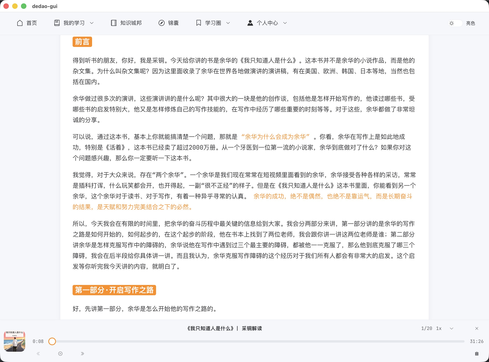
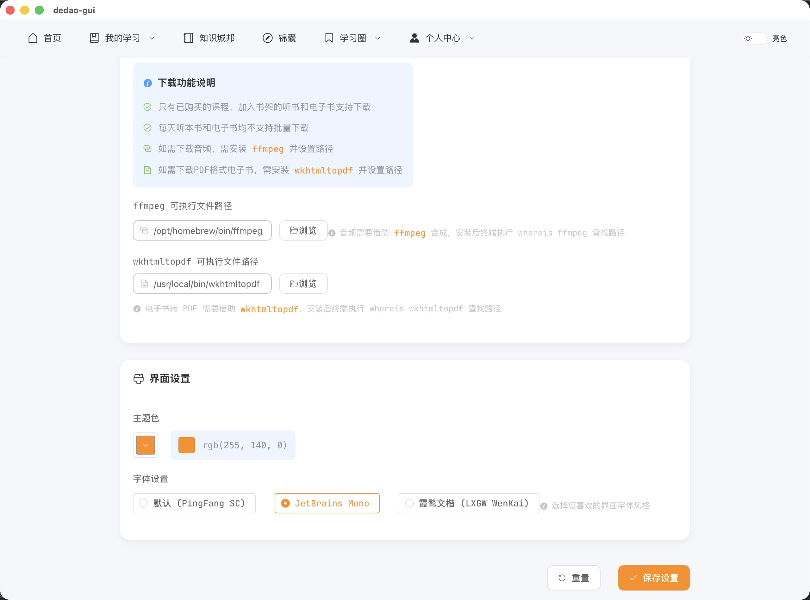

# 得到课程下载桌面端

> wails + go + vue 构建的《得到》APP 课程下载桌面客户端

## 技术栈

* [Wails](https://wails.io/zh-Hans/) - 用于构建桌面应用程序
* [Go](https://go.dev/) - 后端服务和业务逻辑
* [Vue 3](https://cn.vuejs.org/guide/introduction.html) - 前端框架
* [Vue Router 4](https://router.vuejs.org/zh/introduction.html) - 路由管理
* [Element Plus](https://element-plus.org/zh-CN/) - UI 组件库
* [TypeScript](https://www.typescriptlang.org/zh/docs/) - 类型安全
* [Vite](https://cn.vitejs.dev/) - 构建工具
* [Pinia](https://pinia.vuejs.org/zh/) - 状态管理
* [FFmpeg](https://ffmpeg.org/) - 音频处理
* [wkhtmltopdf](https://wkhtmltopdf.org/downloads.html) - PDF 生成


[](https://goreportcard.com/report/github.com/yann0917/dedao-gui)
[](https://deepwiki.com/yann0917/dedao-gui)

## 特别声明

仅供个人学习使用，请尊重版权，内容版权均为得到所有，请勿传播内容！！！

仅供个人学习使用，请尊重版权，内容版权均为得到所有，请勿传播内容！！！

仅供个人学习使用，请尊重版权，内容版权均为得到所有，请勿传播内容！！！

## 主要功能

* **首页展示** - 展示首页内容概览
* **扫码登录** - 支持二维码扫描登录
* **课程管理** - 可查看**购买**的课程，课程详情，课程文章列表，支持播放课程音频
* **听书功能** - 可查看听书书架列表，听书文稿，支持播放每天听本书音频
* **电子书管理** - 可查看电子书架列表，电子书详情，书评，支持加入书架
* **锦囊查看** - 可查看已购买的锦囊
* **知识城邦** - 可查看知识城邦内容
* **内容导出** - 课程可生成PDF，文稿生成 Markdown 文档，也可生成 mp3 文件
* **听书下载** - 每天听本书可下载音频，文稿生成 pdf、 Markdown 文档
* **电子书下载** - 电子书可下载 pdf，html, epub 等格式
* **免费内容** - 免费专区的课程如：《每天听本书》，《文明》，《长谈》等，可下载音频，文稿生成 pdf、 Markdown 文档
* **学习圈** - 可查看学习圈内容（暂不支持下载）
* **主题切换** - UI亮色/暗色主题切换

### 注

1. 下载均在后台执行，下载完毕弹框会关闭，等待弹窗关闭或者点击确定下载后关闭，均会在后台执行下载程序。
2. 如果遇到 `496 NoCertificate` 消息提示，请登录网页版进行图形验证码验证。
3. 本应用上登录后再登录官方网页版会导致保存的 cookie 失效，使用 `rm -rf ~/.config/dedao/config.json` 删除配置信息后重新登陆本应用即可。或者进入个人中心，点击退出登录。

## 安装与运行

### 环境要求

1. 安装 Go 1.23 或更高版本
2. 安装 Node.js 18+ 和 npm
3. 安装 Wails CLI: `go install github.com/wailsapp/wails/v2/cmd/wails@latest`

### 构建步骤

1. 克隆项目仓库
   ```bash
   git clone https://github.com/yann0917/dedao-gui.git
   cd dedao-gui
   ```
2. 直接构建应用（Wails 会自动处理前端依赖安装和构建）
   ```bash
   wails build
   ```

详细构建说明请参考 [Wails 文档](https://wails.io/zh-Hans/docs/introduction)

### 必需依赖

项目运行需要以下依赖：

* **Go** 1.23+ - 后端开发语言
* **Node.js** 18+ - 前端运行环境
* **npm** - 前端包管理器

### 可选依赖（根据需求安装）

如需使用特定功能，请安装以下依赖：

#### PDF 生成

* **wkhtmltopdf**
  > 电子书转 PDF 需要借助 [wkhtmltopdf](https://wkhtmltopdf.org/downloads.html)

#### 音频处理

* **ffmpeg**
  > 音频合成及处理需要借助 [ffmpeg](https://ffmpeg.org/) 工具

## 功能预览





## Stargazers over time

[](https://starchart.cc/yann0917/dedao-gui)

## License

[MIT](./LICENSE) © yann0917

---
