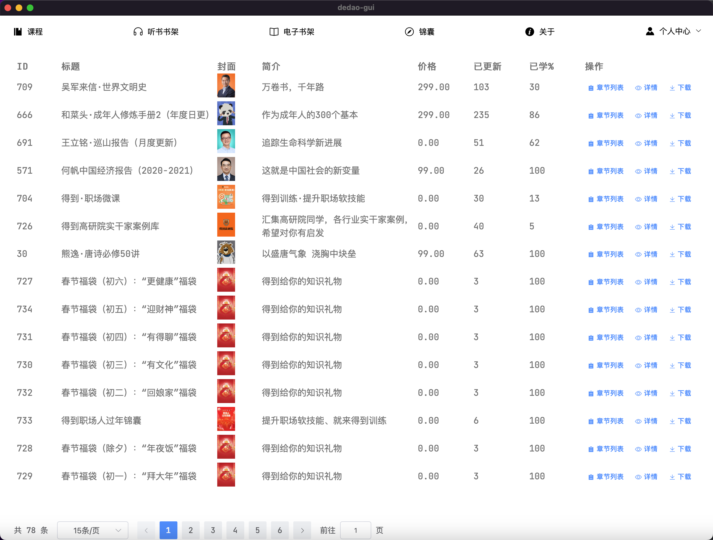
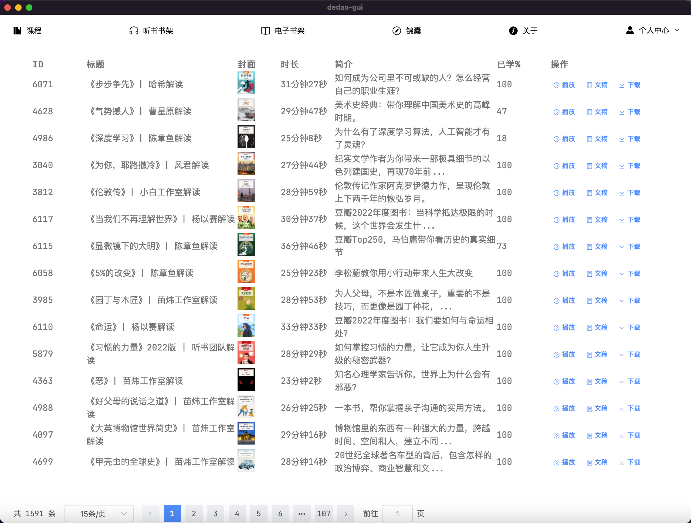
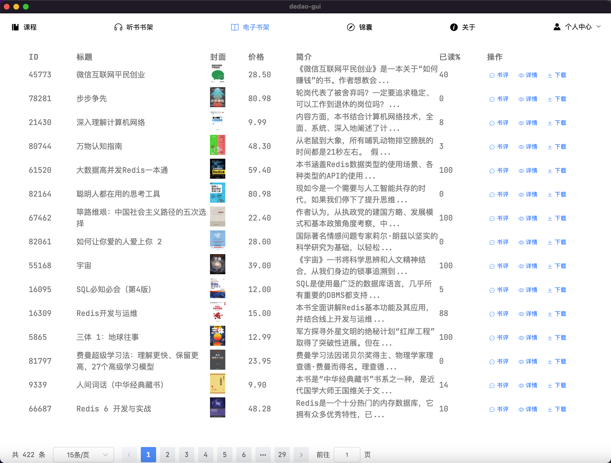
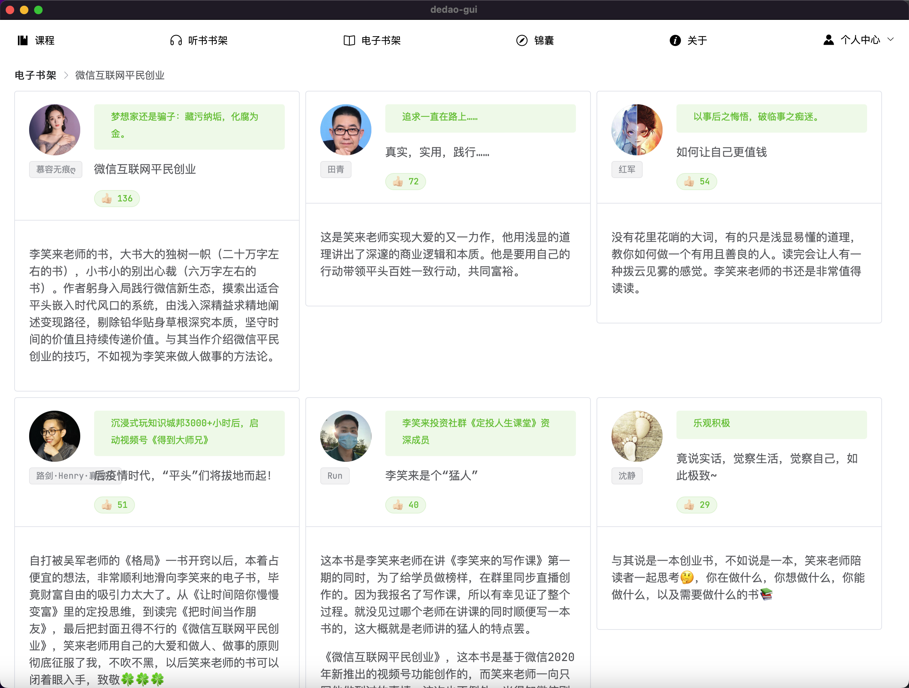
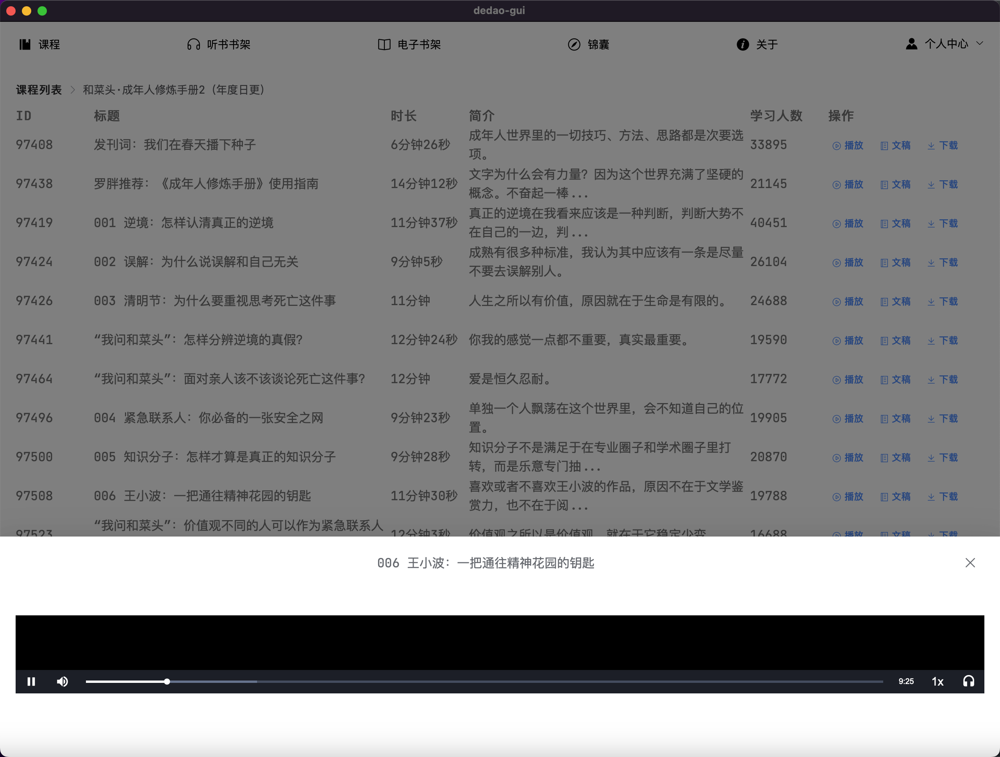

# 得到课程下载桌面端

> wails + go + vue 构建的《得到》APP 课程下载桌面客户端

技术栈如下：

> 1. [wails快速入门](https://wails.io/zh-Hans/)
> 2. [Vue3.x](https://cn.vuejs.org/guide/introduction.html)
> 3. [Vue Router 4.x](https://router.vuejs.org/zh/introduction.html)
> 4. [vue3 element-plus](https://element-plus.org/zh-CN/)
> 5. [typeScript](https://www.typescriptlang.org/zh/docs/)
> 6. [Vite](https://cn.vitejs.dev/)
> 7. [pinia](https://pinia.vuejs.org/zh/)

## 特别声明

仅供个人学习使用，请尊重版权，内容版权均为得到所有，请勿传播内容！！！

仅供个人学习使用，请尊重版权，内容版权均为得到所有，请勿传播内容！！！

仅供个人学习使用，请尊重版权，内容版权均为得到所有，请勿传播内容！！！

## 特性

* 展示首页内容
* 可扫码登录
* 可查看**购买**的课程，课程详情，课程文章列表，可播放课程音频
* 可查看听书书架列表，听书文稿，可播放每天听本书音频
* 可查看电子书架列表，电子书详情，书评，可加入书架
* 可查看已购买的锦囊
* 可查看知识城邦
* 课程可生成PDF，文稿生成 Markdown 文档，也可生成 mp3 文件
* 每天听本书可下载音频，文稿生成 pdf、 Markdown 文档
* 电子书可下载 pdf，html, epub 等格式
* UI亮色/暗色主题切换

### 注

1. 下载均在后台执行，下载完毕弹框会关闭，等待弹窗关闭或者点击确定下载后关闭，均会在后台执行下载程序。
2. 如果遇到 `496 NoCertificate` 消息提示，请登录网页版进行图形验证码验证。
3. 本应用上登录后再登录官方网页版会导致保存的 cookie 失效，使用 `rm -rf ~/.config/dedao/config.json` 删除配置信息后重新登陆本应用即可。

## 安装

构建请查看[wails 文档](https://wails.io/zh-Hans/docs/introduction)

1. `运行 go install github.com/wailsapp/wails/v2/cmd/wails@latest` 安装 Wails CLI。
2. clone 该项目，从项目目录，执行 `wails build`，即可构建二进制文件

### 安装依赖

wails 构建需要安装以下依赖：

* Go 1.23+
* NPM (Node 18+)

如果需要下载相应格式的内容，请按照下载需求，安装下列依赖：

#### pdf下载

* wkhtmltopdf
  > 电子书转 PDF 需要借助[wkhtmltopdf](https://wkhtmltopdf.org/downloads.html)

#### 音频下载

* ffmpeg
  > 音频需要借助 [ffmpeg](https://ffmpeg.org/) 合成

### 功能截图如下

## Stargazers over time

## License

[MIT](./LICENSE) © yann0917

---
